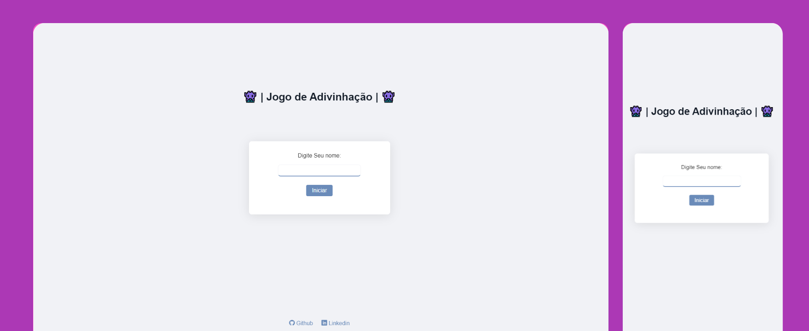

<h1 align="center"> 👾  Jogo de Adivinhação. 👾 </h1>

	

## 👾  Sobre o projeto

O próposito desse estudo era criar um **Jogo com codigos limpo** utilizando HTML,CSS e JS. Este projeto se enquadra na minha sessão pessoal, onde estou praticando para o meu futuro ingresso no mercado de trabalho.
Jogo de adivinhação é um projeto onde eu queria praticar as function, e um pouco de DOM de esconder paginas e mostrar a proxima.

---

## 🛠 Tecnologias e ferramentas utilizadas:

As seguintes ferramentas foram usadas na construção do projeto:

## 🖥️ Demonstração

- Você pode acessar o projeto clicando <a href="https://fabricio-roca.github.io/jogo-adivinhacao/">aqui</a>.

---

### 📝 Utilitários

- [getmoji](https://getemoji.com)

---

Criado com 💙 por [Fabricio Roca](https://github.com/fabricio-roca)
